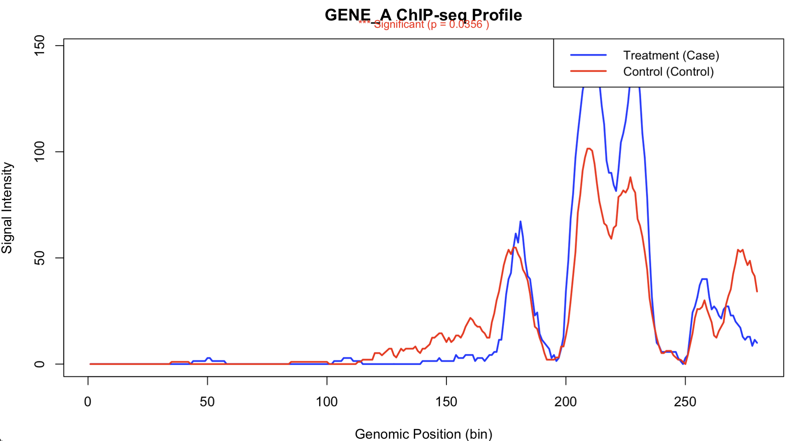

# KernelTest

<!-- badges: start -->
<!-- badges: end -->

**High-performance R package for detecting differential histone enrichment in ChIP-seq data using kernel-based nonparametric tests.**

## 1. Overview

`KernelTest` accepts paired design matrices containing ChIP-seq read counts or normalized intensities for genes under case and control conditions. For each gene, columns represent genomic bins ordered along the locus. The package implements kernel smoothing procedures (Gaussian kernel with Nadaraya-Watson estimator) to estimate smoothed enrichment profiles and conduct hypothesis tests for differential binding.

**Key Features:**
- Fast C++ implementation using Rcpp/RcppArmadillo (3-5x faster than pure R)
- Three variance estimation methods (equal, unequal, kernel-smoothed)
- Nonparametric tests without restrictive parametric assumptions
- Gene-level test statistics, p-values, and variance estimates
- Built-in visualization with customizable plots
- Designed for modern ChIP-seq differential enrichment analysis


## 2. Installation

```r
# install.packages("devtools")
devtools::install_github("ITCUI-XJTLU/KernelTest")
```


## 3. Quick Start

### 3.1 Basic Usage

The `TS_twosample` function now includes **built-in visualization**:

```r
library(KernelTest)

# Load example data (5 genes × 280 bins)
data(data1)  # Condition 1 (case)
data(data4)  # Condition 2 (control)

# Step 1: Estimate bias term from stable genes
tao <- est.c(data1, data4, max1 = 5, max4 = 5)

# Step 2: Run test with automatic plotting
results <- TS_twosample(
  data1 = data1,
  data4 = data4,
  tao = tao,
  band = 180,
  quant = c(0.01, 0.01, 0.01),
  plot = TRUE,                     # Enable visualization
  alpha = 0.05                     # Significance level
)

# The function will automatically generate:
# ✓ Summary plots (4 panels): test statistics, variance comparisons
# ✓ Detailed ChIP-seq profiles for significant genes
# ✓ Statistical summaries with p-values
```


### 3.2 Advanced Visualization Options

```r
# Plot specific genes with custom names
results <- TS_twosample(
  data1 = data1,
  data4 = data4,
  tao = tao,
  band = 180,
  quant = c(0.01, 0.01, 0.01),
  plot = TRUE,
  plot_genes = c(1, 3, 5),         # Specify which genes to plot in detail
  gene_names = c("GENE_A", "GENE_B", "GENE_C", "GENE_D", "GENE_E"),
  condition_names = c("Control", "Treatment"),
  alpha = 0.05
)

# Access results
print(results$significant_genes)
print(results$p_values)
```

### 3.3 Example Output

```r
# Results include:
$TS_kn
[1]  4.037773  4.174773  2.270013  1.704636 11.965013

$p_values
[1] 5.404e-05 3.000e-05 2.320e-02 8.828e-02 5.213e-33

$significant_genes
[1] 1 2 3 5
```


## 4. Getting Help
```r
# View function documentation
?TS_twosample

# Check function parameters
args(TS_twosample)

# Run example
source("FINAL_DEMO.R")
```

## 5. Methods

The package implements:

1. **Bias term estimation** (`est.c`): Identifies stable genes and estimates autocorrelation bias
2. **Kernel smoothing**: Nadaraya-Watson estimator with Gaussian kernel
3. **Variance estimation**: Three methods (equal, unequal, kernel-smoothed)
4. **Test statistics**: Wilson-Hilferty transformation for approximate normality


## 6. Maintainer
Tengfei Cui (tfcui2025@tamuedu)


